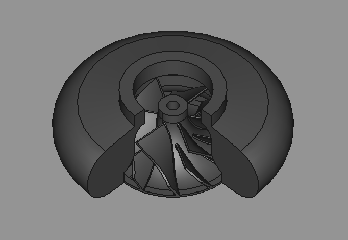

# FreeCAD-Builds Repository

  
   

Dieses Repository bietet eine Sammlung von FreeCAD-Builds für unterschiedliche Anwendungsfälle.

## Inhaltsverzeichnis

- [Builds](builds)
- [Gehäuse](case)
- [Tutorial-Builds](tutorial_builds)
- [Verdichterrad](Verdichterrad)

---

## Gehäuse-Designs

Im Ordner `case` finden Sie FreeCAD-Builds speziell für Gehäuse-Designs:
- `Gehäuse`
- `Halterung_außen`
- `Halterung_innen`
- `Verdichterrad`

---

## Außenhalterungen

Der Ordner `Halterung_außen` beinhaltet Designs für Außenhalterungen, welche für externe Befestigungen konzipiert sind.

---

## Innenhalterungen

Im Ordner `Halterung_innen` befinden sich Builds für Innenhalterungen, die speziell als Gegenstück zu den Außenhalterungen dienen.

---

## Verdichterrad

Der Ordner `Verdichterrad` enthält Entwürfe für ein Verdichterrad inklusive Gehäuse.

## Abhängigkeiten

- **Workbench:** Werkzeuge und Vorrichtungen für Innengewinde.
- **Dateiformate:** Die Dateien sind im Format .FCstd und .FCBak verfügbar und kompatibel mit FreeCAD.

---
