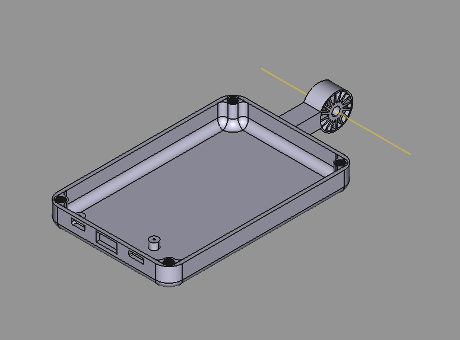

# FreeCAD_builds

  

Dieses Repository enthält verschiedene FreeCAD-Builds für verschiedene Anwendungsfälle.

## Inhaltsverzeichnis

- ["case"](#ordner-case)

---

## Ordner "case"

Der Ordner "case" enthält FreeCAD-Builds für Gehäuse-Designs.
- [ Gehäuse](#ordner-Gehäuse)
- [ Halterung_außen](#ordner-halterung-außen)
- [ Halterung_innen](#ordner-halterung-innen)
- [ Verdichterrad](#Verdichterrad)

---

## Ordner "Halterung_außen"

Der Ordner "halterung außen" enthält FreeCAD-Builds für Außenhalterungen.
für die Befestigung 

---

## Ordner "Halterung_innen"

Der Ordner "halterung innen" enthält FreeCAD-Builds für Innenhalterungen.
Speziell das gegenstück für die Halterung

---

## Ordner "Verdichterrad"

In diesem Ordner befindet sich ein erster Entwurf für ein Verdichterrad mit Gehäuse

## Dependencies

- **Workbench:** Befestigungsmittel für das Innengewinde.
- **Dateiformat:** Die Dateien haben das Format .FCstd, .FCBak und sind kompatibel mit FreeCAD.
